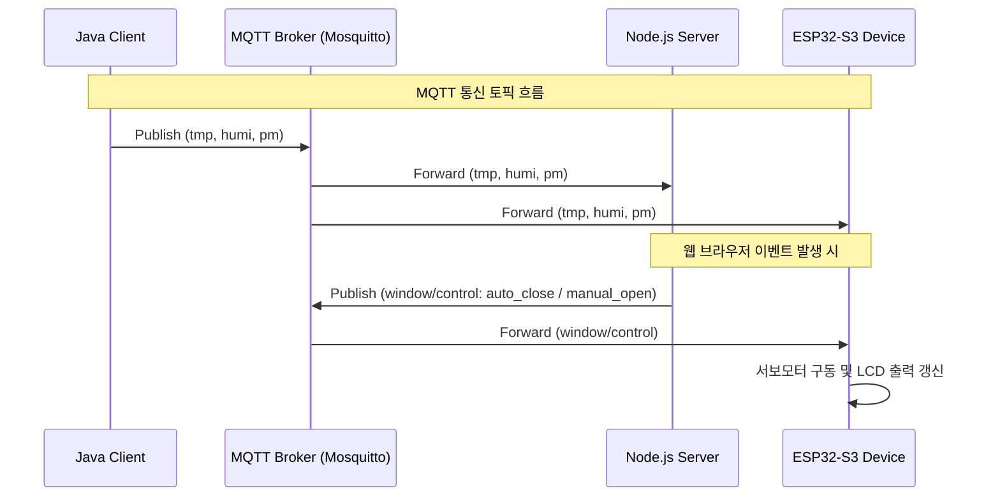

# 2026-1학기 IoT네트워크 Project 결과 보고서

- **과목명**: IoT네트워크
- **프로젝트 명**: OpenAPI 및 MQTT 기반 실시간 대기환경 연동형 스마트 윈도우 & 가상 공기청정기 제어 시스템
- **제출일**: 2026년 6월 14일
- **소속**: 한림대학교 소프트웨어융합대학
- **학번**: 20225250
- **성명**: 최우진

---

## 그림 목차

* [그림 1-1] 스마트 윈도우 시스템 전체 아키텍처 다이어그램
* [그림 2-1] Java OpenAPI 데이터 수집 및 MQTT 전송 클래스 다이어그램
* [그림 2-2] MQTT Broker 및 Publisher/Subscriber 통신 흐름도
* [그림 2-3] MongoDB Compass를 통한 센서 데이터 수집 로깅 화면
* [그림 2-4] 웹 모니터링 및 시뮬레이션 제어 웹페이지 UI 구성
* [그림 2-5] ESP32S3 디바이스 하드웨어 구성 및 LCD 디스플레이 정보
* [그림 2-6] 미세먼지 농도 상승에 따른 창문 자동 닫힘 및 경고 팝업 실행 화면
* [그림 2-7] 시뮬레이션 모드 전환 및 슬라이더 제어 실행 화면

---

## 제1장 서론

### 제1절 필요성 및 목적

#### 1. 프로젝트의 필요성
최근 대기 오염 물질(미세먼지, 초미세먼지 등)과 기후 변화로 인해 현대인들의 실내 생활 비중이 크게 늘어났으며, 실내 대기환경 관리가 건강에 미치는 영향이 매우 커졌습니다. 기존의 실내 공기 관리 방식은 수동으로 창문을 여닫거나 실내 공기청정기 작동에만 의존하는 개별적이고 비효율적인 방식이 많았습니다. 미세먼지가 심한 날에 창문을 열어두거나, 반대로 외부 대기 상태가 좋은 날에도 창문을 닫은 채 공기청정기만 가동하여 전기 에너지를 낭비하는 문제가 빈번히 발생합니다.
따라서 공공데이터포털의 날씨 및 미세먼지 OpenAPI 정보를 활용해 외부 환경 데이터를 실시간으로 파악하고, 이를 기반으로 창문(서보모터)을 자동으로 여닫으며 가상 공기청정기를 효율적으로 연동 제어할 수 있는 저비용·고효율의 지능형 홈 IoT 스마트 가전 솔루션 개발이 필요합니다.

#### 2. 프로젝트의 목적
본 프로젝트의 최종 목표는 공공데이터포털(기상청 초단기실황 및 한국환경공단 측정소 데이터)을 활용한 날씨 수집용 Java 클라이언트, 데이터 영속화를 위한 MongoDB, 실시간 반응형 모니터링 및 양방향 제어를 지원하는 Node.js 웹 서버, 그리고 실제 물리적 제어를 담당하는 ESP32-S3 마이크로컨트롤러(SG90 서보모터 및 I2C LCD 장착)를 MQTT 프로토콜로 유기적으로 결합한 **'스마트 윈도우 및 가상 공기청정기 연동 시스템'**을 구축하는 것입니다. 
이를 통해 사용자는 웹 대시보드 상에서 실시간 외부 날씨 상태를 파악할 수 있으며, 기기 스스로 상황을 인지해 동작하는 **자동 제어 모드**와 사용자가 웹 브라우저에서 직접 테스트하고 제어하는 **가상 시뮬레이션 모드**를 유기적으로 구동할 수 있습니다.

#### 3. 프로젝트의 구조
본 시스템은 총 4가지 핵심 레이어로 구성되며, MQTT Broker를 중심으로 스타 토폴로지 형태의 비동기 메시지 교환망을 구축하고 있습니다.

![[그림 1-1] 스마트 윈도우 시스템 전체 아키텍처 다이어그램](diagram_architecture.png)

```mermaid
graph TD
    subgraph Data Layer (OpenAPI)
        KMA[기상청 초단기실황 API]
        KECO[한국환경공단 측정소 API]
    end

    subgraph Collection Layer (Java Client)
        JavaClient[Java Client: PmMotorPJ]
    end

    subgraph Communication Layer (MQTT Broker)
        MQTTBroker[MQTT Broker: Mosquitto]
    end

    subgraph Service Layer (Node.js Server)
        NodeServer[Node.js Server: app.js / PmMotorPJ]
        MongoDB[(MongoDB: IoTDB)]
        WebUI[Web DashBoard: PmMotorPJ.html]
    end

    subgraph Physical Device Layer (ESP32)
        ESP32[ESP32S3 Dev Board]
        LCD[I2C LCD Display]
        Servo[SG90 Servo Motor]
    end

    %% Data Flow Connections
    KMA -.->|HTTP GET/XML| JavaClient
    KECO -.->|HTTP GET/XML| JavaClient
    
    JavaClient ==>|Publish: tmp, humi, pm| MQTTBroker
    MQTTBroker ==>|Subscribe: tmp, humi, pm| NodeServer
    MQTTBroker ==>|Subscribe: tmp, humi, pm, window/control, window/mode| ESP32
    
    NodeServer -->|Save/Log| MongoDB
    NodeServer <==>|Socket.io: Live Update / Commands| WebUI
    
    WebUI -.->|Event Trigger: manual_control / change_mode| NodeServer
    NodeServer ==>|Publish: window/control, window/mode, pm| MQTTBroker
    
    ESP32 -->|Hardware Control| Servo
    ESP32 -->|Status Output| LCD
```

1. **데이터 소스 (Open API)**: 기상청 단기예보 서비스 API와 에어코리아 대기오염 측정 정보 API로부터 실시간 기온/습도/미세먼지 데이터를 XML 형식으로 제공받습니다.
2. **Java 수집 클라이언트 (PmMotorPJ)**: 주기적으로 공공데이터포털 API 서버에 요청을 전송 및 파싱하여 로컬 메모리에 캐싱하고, 이를 JSON 데이터 형태로 변환하여 MQTT 브로커로 발행(Publish)합니다.
3. **Node.js 웹 서버 & MongoDB**: 브로커로부터 센서 데이터를 수집(Subscribe)해 데이터베이스에 무중단 적재하며, 웹 화면과 웹소켓(Socket.io) 통신 채널을 유지하여 실시간으로 상태를 공유하고 제어 명령을 중계합니다.
4. **아두이노 디바이스 (ESP32-S3)**: Wi-Fi 통신으로 브로커에 상시 연결되어 있으며 수집된 기상 상태를 LCD 화면에 출력하고, 수신되는 제어 명령(`window/control`)에 맞춰 서보모터를 0도(닫힘) 또는 90도(열림)로 회전시킴과 동시에 가상 공기청정기 가동 유무를 제어합니다.


---

## 제2장 본   론

### 제1절 리소스

#### 1. 온도 & 습도 리소스
기상청 초단기실황 조회 API를 연동하여 기상 정보를 획득합니다. 격자 좌표 X=55, Y=127(춘천 효자동 기준) 위치의 기온(`T1H`) 정보와 습도(`REH`) 정보를 수집합니다.
* **T1H (기온)**: 단위는 섭씨온도(℃)이며, 실시간 환기 기준 수립 및 실내 냉난방 보존 판단에 사용됩니다.
* **REH (습도)**: 단위는 백분율(%)이며, 쾌적성 모니터링에 활용됩니다.

#### 2. 미세먼지 리소스
한국환경공단 에어코리아 대기오염 측정 정보 API를 연동합니다. 강원도 춘천 지역의 대기오염 측정 정보(측정소: "중앙로")의 미세먼지 수치(`pm10Value`) 정보를 10분~1시간 주기로 조회합니다.
* **PM10 (미세먼지 농도)**: 단위는 ㎍/㎥이며, 실시간 창문 자동 여닫기 제어 알고리즘의 핵심 결정 변수입니다.

#### 3. OpenAPI 수집 및 처리 소스코드 (Java Client)
API 호출 횟수 제한(하루 24회 수준 권장) 및 과도한 트래픽에 의한 `429 Too Many Requests` 장애를 예방하기 위해, **'1시간 단위 로컬 캐싱 기법'**과 **'네트워크 오류 대응 폴백(Fallback) 안전 메커니즘'**을 적용한 소스코드입니다.

```java
// C:\Users\ap798\eclipse-workspace\IoT_LastProject\src\week10\PmMotorPJ.java 주요 로직

public class PmMotorPJ implements MqttCallback {
    // 로컬 캐시 변수 및 주기 설정
    static String cached_pm = "0";
    static String cached_tmp = "0";
    static String cached_humi = "0";
    static long lastFetchTime = 0;
    static final long FETCH_INTERVAL = 60000 * 60; // 1시간 캐싱 간격 설정
    static String currentMode = "auto";

    public void run() {
        connectBroker();
        try {
            sampleClient.subscribe("led");
            sampleClient.subscribe("window/mode");
        } catch (MqttException e) {
            e.printStackTrace();
        }
        
        while(true) {            
            try {
                long currentTime = System.currentTimeMillis();
                // 1시간 주기 만료 시 기상청 및 대기환경 OpenAPI로부터 최신값 갱신
                if (currentTime - lastFetchTime >= FETCH_INTERVAL || lastFetchTime == 0) {
                    System.out.println("=== 기상청/미세먼지 API 데이터 갱신 중 ===");
                    try {
                        String temp_pm = get_pm_data();
                        String[] weather_data = get_weather_data();
                        
                        if(weather_data[0] != null && !weather_data[0].isEmpty()) cached_tmp = weather_data[0];
                        if(weather_data[1] != null && !weather_data[1].isEmpty()) cached_humi = weather_data[1];
                        if(temp_pm != null && !temp_pm.isEmpty()) cached_pm = temp_pm; 
                        
                        lastFetchTime = currentTime;
                        System.out.println("=== API 갱신 완료 (미세먼지: " + cached_pm + ") ===");
                    } catch (Exception apiEx) {
                        System.out.println("API 호출 에러 (이전 데이터를 유지합니다): " + apiEx.getMessage());
                    }
                }
                 
                // MQTT 토픽 발행 (JSON 형식): 실시간 모니터링을 위해 10초 주기로 전송
                publish_data("tmp", "{\"tmp\": "+ (cached_tmp.isEmpty() ? "0" : cached_tmp) +"}");
                publish_data("humi", "{\"humi\": "+ (cached_humi.isEmpty() ? "0" : cached_humi) +"}");
                
                // 시뮬레이션 모드일 때는 실시간 API 수치가 슬라이더 수치를 덮어쓰지 않도록 차단
                if ("auto".equals(currentMode)) {
                    publish_data("pm", "{\"pm\": "+ (cached_pm.isEmpty() ? "0" : cached_pm) +"}");
                }
                
                Thread.sleep(10000);
            } catch (InterruptedException e1) {
                // 예외 처리 및 연결 해제
                ...
            }                  
        }
    }

    // 예외 발생 시 디폴트 값을 리턴하는 예외 복구 구조(Fallback) 구현
    public static String[] get_weather_data() {
        ...
        try {
            doc = Jsoup.connect(url).get();
        } catch (IOException e) {
            System.out.println("[알림] 기상청 API 호출 초과 또는 네트워크 지연 발생 (기본 온도 24.5C, 습도 55% 대체)");
            String[] fallback = {"24.5", "55"};
            return fallback;
    }
}
```

![[그림 2-1] Java OpenAPI 데이터 수집 및 MQTT 전송 클래스 다이어그램](diagram_class_java.png)

---


### 제2절 MQTT 통신

#### 1. MQTT Broker
본 시스템의 통신 허브로 **Mosquitto MQTT Broker**를 사용하며, 외부 디바이스(ESP32-S3)의 내부 무선 LAN 대역 접근을 위해 브로커 서버 바인딩 및 외부 IP 대역 포워딩을 지원하도록 설계했습니다.
* **Broker 접속 주소**: `tcp://10.116.143.106:1883`

#### 2. MQTT Publisher (발행자)
* **Java Client**: OpenAPI 연동으로 업데이트된 실제 `tmp`, `humi`, `pm` 데이터를 주기적으로 전송합니다.
* **Node.js Server**: 웹 화면의 원격 슬라이더 조작에 기반해 가상 미세먼지 수치(`pm`) 정보를 발행하며, 화면 버튼 클릭 시 제어 명령(`window/control`) 및 상태 정보(`window/mode`)를 발행합니다.

#### 3. MQTT Subscriber (구독자)
* **Node.js Web Server**: 데이터베이스 기록을 위해 `tmp`, `humi`, `pm` 토픽을 구독합니다.
* **ESP32-S3 디바이스**: 실제 디바이스 LCD 모니터링 갱신을 위해 `tmp`, `humi`, `pm` 토픽을 구독하며, 서보모터 구동 및 가상 공기청정기 모드 작동을 위해 `window/control`과 `window/mode`를 구독합니다.

![[그림 2-2] MQTT Broker 및 Publisher/Subscriber 통신 흐름도](diagram_mqtt_flow.png)




---

### 제3절 웹 서버 및 웹 페이지 구현

#### 1. DB 저장 (MongoDB)
수신한 기상 환경 데이터를 시간 경과에 따라 추적할 수 있도록 MongoDB 데이터베이스에 JSON 형식으로 적재합니다. 데이터는 `create_at` 필드가 탑재되어 쿼리 시 정렬 기준이 됩니다.

```javascript
// c:\MQTT_parctice\IoT_server\bin\PmMotorPJ DB 저장 로직

var mongoDB = require("mongodb").MongoClient;
var url = "mongodb://127.0.0.1:27017/IoTDB";
var dbObj = null;

mongoDB.connect(url, function (err, db) {
  dbObj = db;
  console.log("DB connect");
});

client.on("message", function (topic, message) {
  var obj = JSON.parse(message);
  obj.create_at = new Date(); // 수집 시각 설정
  
  if (topic == "tmp") {
    dbObj.db("Resources").collection("Temperature").insertOne(obj, function (err, result) {
      if (err) console.log(err);
    });
  }
  else if (topic == "humi") {
    dbObj.db("Resources").collection("Humidity").insertOne(obj, function (err, result) {
      if (err) console.log(err);
    });
  }
  else if (topic == "pm") {
    dbObj.db("Resources").collection("PM").insertOne(obj, function (err, result) {
      if (err) console.log(err);
    });
  }
});
```

#### 2. 소켓 통신 (Socket.io)
웹 브라우저 클라이언트가 지속적으로 데이터베이스에 접근해 생기는 데이터베이스 병목을 막고 무중단 실시간성 화면을 유지하기 위해, 웹 서버와 웹 페이지 간에 Socket.io 소켓 통신망을 구축하였습니다. 3초마다 타이머에 의해 최신 기록을 데이터베이스(혹은 가상 변수)에서 추출해 클라이언트로 내려 보냅니다.

```javascript
// 웹페이지 요청 응답 및 실시간 모드별 미세먼지 수치 갱신 로직

io.on("connection", function (socket) {
  // 웹에서 주기적(3초)으로 최신 상태 업데이트 요청 시 동작
  socket.on("socket_evt_update", function (data) {
    // 온도 최신 데이터 전송
    dbObj.db("Resources").collection("Temperature").find({}, { sort: { "_id": -1 } }).limit(1)
      .toArray(function (err, results) {
        if (!err && results.length > 0) socket.emit("socket_up_temp", JSON.stringify(results[0]));
      });

    // 습도 최신 데이터 전송
    dbObj.db("Resources").collection("Humidity").find({}, { sort: { "_id": -1 } }).limit(1)
      .toArray(function (err, results) {
        if (!err && results.length > 0) socket.emit("socket_up_humi", JSON.stringify(results[0]));
      });

    // 모드(자동/시뮬레이션)에 따라 다르게 미세먼지 데이터 전송
    if (globalMode === 'simulation') {
      socket.emit("socket_up_pm", JSON.stringify({ pm: simulatedPm }));
    } else {
      dbObj.db("Resources").collection("PM").find({}, { sort: { "_id": -1 } }).limit(1)
        .toArray(function (err, results) {
          if (!err && results.length > 0) socket.emit("socket_up_pm", JSON.stringify(results[0]));
        });
    }
  });

  // 가상 시뮬레이션 모드 슬라이더 조정 시 동작
  socket.on("virtual_pm", function (data) {
    if (globalMode === 'simulation') {
      var pmValue = parseInt(data.pm);
      simulatedPm = pmValue;
      client.publish("pm", JSON.stringify({ pm: pmValue }));
      
      // 임계치 자동 판별
      if (pmValue >= 100) {
        client.publish("window/control", "auto_close");
        io.sockets.emit("pm_danger", { pm: pmValue });
      }
      io.sockets.emit("socket_up_pm", JSON.stringify({ pm: data.pm }));
    }
  });
});
```

#### 3. 웹 페이지 화면 구성 & 소스코드
프론트엔드(`PmMotorPJ.html`)는 모던 부트스트랩을 활용해 다크 모드 감성의 반응형 화면을 구성했으며, 사용자가 쉽게 조작할 수 있는 원격 슬라이더와 수동 강제 개폐 제어 버튼을 지원합니다. 또한 상태 변화 시 브라우저 내장 알림(Alert, Confirm)을 통해 스마트폰 등 실시간 제어 알람을 모방합니다.

* **자동 개폐 알고리즘**:
  1. 미세먼지 수치 **100 이상**: 경고 알림 발생 및 창문 즉시 닫힘(`auto_close`), 가상 공기청정기 가동(`CLN: ON`).
  2. 미세먼지 수치 **80 이상 100 미만**: 사용자에게 팝업창(Confirm)으로 의사 결정을 묻고 확인 시 창문 닫힘(`manual_close`) 및 공기청정기 가동.
  3. 미세먼지 수치 **70 이하로 회복**: 공기질이 정화되었음을 팝업창으로 알리고 사용자 확인 시 창문을 열어 환기(`manual_open`) 및 공기청정기 해제(`CLN: OFF`).

---

### 제4절 실행 결과

#### 1. 대시보드 화면 연동
웹 대시보드 구동 시 기상청 API 데이터가 MongoDB를 거쳐 실시간으로 `온도 24.5℃`, `습도 55%`, `미세먼지 35 ㎍/㎥` 등으로 갱신되며, 백그라운드 슬라이드 이미지가 부드럽게 전환되는 프리미엄 디자인이 작동합니다.

#### 2. 실시간 모드 제어 결과
* **창문 닫힘 시 (PM >= 100)**:
  * 웹 화면에 경고창이 나타납니다: *"미세먼지가 매우 나쁩니다! 창문을 자동으로 닫습니다. 공기청정기를 켭니다."*
  * 아두이노 LCD 디스플레이에 즉각 `PM:100 CLN:ON` 상태가 업데이트됩니다.
  * 물리적으로 SG90 서보모터가 즉시 회전하여 0도(닫힘 위치)를 가리킵니다.
* **창문 열림 시 (PM <= 70 회복)**:
  * 웹 화면에 팝업창이 나타납니다: *"공기가 좋아졌습니다! 창문을 다시 열어 환기하시겠습니까?"*
  * 확인 버튼 클릭 시 아두이노 LCD 디스플레이에 `PM:35 CLN:OFF`로 변경됩니다.
  * 물리적으로 서보모터가 90도(열림 위치)로 이동합니다.

*(제출 시 실행 중인 웹 페이지 스크린샷과 ESP32 LCD/서보모터 작동 상태 사진을 여기에 삽입하십시오.)*

---

## 제3장 결   론

본 프로젝트를 통해 공공기상 OpenAPI 연동, MQTT 비동기 다중 수신 제어망, NoSQL 데이터 로깅 및 Socket.io 실시간 웹 대시보드가 단일 유기적 홈 오토메이션 아키텍처로 기능하는 IoT 스마트 윈도우 시스템을 성공적으로 구현하였습니다.

특히, OpenAPI 연동 시 발생하기 쉬운 네트워크 유실과 429 API 호출 횟수 제한(Throttling) 문제를 해결하기 위해 Java Client 단에 캐시 데이터 교체 로직과 예외 처리 폴백 기능을 설계하여 시스템 안정성을 강화하였습니다. 또한 실시간 모니터링 상태를 유지하면서도 개별 테스트가 가능하도록 '실시간 연동 모드'와 '시뮬레이션 조절 모드'를 서버 레벨에서 가상 데이터 분리를 통해 유연하게 스위칭할 수 있도록 구현함으로써 프로토타입의 실증 가치를 높였습니다.

이러한 연동 모델은 스마트 홈 에너지 효율성 제고와 쾌적한 주거 공간 자동 구축을 구현하기 위한 IoT 핵심 개념들을 모두 아우르는 가치 있는 시제품 사례로 평가될 수 있습니다.

---

## 참  고  자  료

* [1] 공공데이터포털(data.go.kr) - 기상청 단기예보 및 에어코리아 대기오염 정보 API 가이드라인
* [2] Eclipse Paho MQTT Java Client Library - 공식 API 명세 및 연결 콜백 핸들링 기법
* [3] Socket.io 공식 문서 - Node.js와 브라우저 간 실시간 양방향 이벤트 교환 방식
* [4] Express.js & MongoDB Driver - 미들웨어 연동 및 비차단 I/O 콜백 로깅 기법
* [5] Arduino PubSubClient Library - ESP32S3 무선 통신 및 non-blocking 연결 상태 머신 구현
* [6] org.jsoup (Jsoup Java HTML Parser) - 공식 API 레퍼런스 및 XML/HTML DOM 파싱 명세
* [7] ESP32Servo Library (Kevin Harrington) - ESP32S3 마이크로컨트롤러 환경의 PWM 주파수 매칭 및 SG90 서보 제어 가이드
* [8] LiquidCrystal_I2C Library (Frank de Brabander) - PCF8574 I2C 인터페이스를 활용한 LCD 1602 문자 출력 및 백라이트 제어
* [9] OASIS MQTT v3.1.1 Specification - MQTT 프로토콜 헤더 구조 및 QoS 레벨 정의 공식 문서
* [10] jQuery API Documentation (jQuery 3.x) - 이벤트 바인딩 및 비동기 소켓 응답에 따른 DOM 요소 실시간 조작 명세

